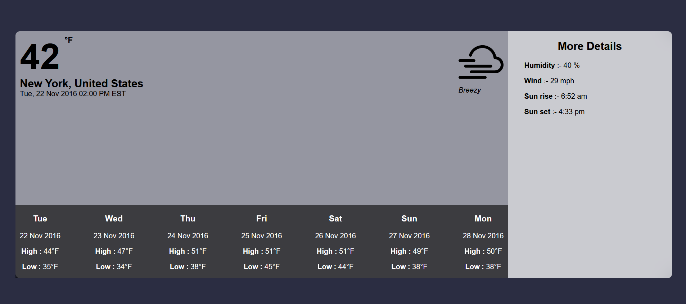

# weather-UI
This is a frontend UI of weather app. In this I used a json file and deployed that file on heroku to use data in my project. This UI is only made in 2 hour testing my self and first time an UI with this short period of time. I will improve more and more to make a much better UI with more less period of time.

### Made by :- Deepanshu Gulia

## Steps to run application on local server

* Clone this repository locally.
  
* <kbd>npm run dev</kbd> ==> After clone just start react server by using this command in terminal 

### Tech stack :- 
 HTML | CSS | Javascript | React | json-server | heroku | vercel

## Image of project

Thank you ❤️
